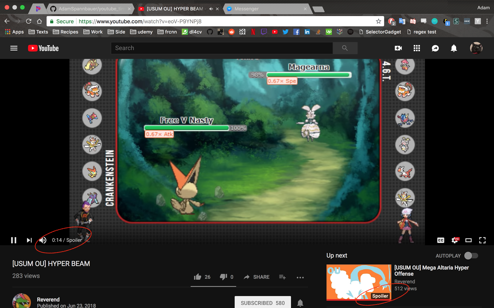

# Block YouTube Times 

##### Chrome extension to block YouTube's times/progress bar to avoid spoilers from video length.

*Warning: if anyone stumbles across this page.  This is my first 'real' chrome extension; don't expect perfection.*

## Functionality

Hides the following when your browsing YouTube:

* Progress Bar
* Video Duration Overlay
* Thumbnail Time Overlay

## Example

## Install

(I don't want to pay Google the $5 it takes to deploy this to the web store)

* Clone this repo (or download as zip and unzip)
* Follow these instructions from [a9t9](https://a9t9.com/howto/install-chrome-extension-from-file) to install a chrome extension from file